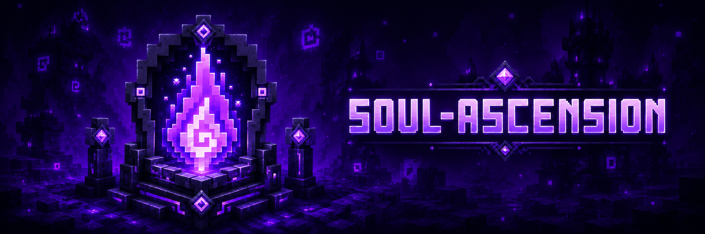

<p align="center">
  <a href="https://github.com/tracerxbrhd/soul-ascension/releases"></a>
  <a href="https://github.com/tracerxbrhd/soul-ascension/actions/workflows/ci.yml"></a>
  <a href="https://modrinth.com/mod/soul-ascension"></a>
  <a href="https://www.curseforge.com/minecraft/mc-mods/soul-ascension"></a>
</p>

# SOUL ASCENSION

**SOUL ASCENSION turns combat into persistent character progression.** Deal valid damage, gain character experience, level up, invest points into RPG attributes, unlock titles and inspect builds through a dedicated U-API interface.

The mod is designed for vanilla-style worlds, RPG modpacks, combat overhauls and multiplayer servers without making optional integrations mandatory.

## Compatibility

| Minecraft | Soul Ascension line | U-API | Java | Loader |
| --- | --- | --- | --- | --- |
| 1.21.1 | 2.x | 2.x | 21 | NeoForge |
| 26.2 | 3.x | 3.x | 25 | NeoForge |

The default `master` branch currently contains the Minecraft 1.21.1 / Soul Ascension 2.x source line. The latest stable release may target another supported Minecraft version; use the release badge or download pages above for the current published build.

## Character progression

Soul Ascension provides five core characteristics:

- **Strength**
- **Endurance**
- **Agility**
- **Intelligence**
- **Perception**

Attribute rewards, caps, progression speed, maximum level and respec behavior are configurable. Point allocation is staged as a preview before the server validates and applies the final build.

## Core features

- damage-based character progression and configurable level scaling;
- RPG attributes with vanilla and compatible modded attribute rewards;
- unlockable and selectable titles;
- **Soul Badge** for character profiles;
- **Soul Lens** for compact build inspection;
- **Amnesia Scroll** and **Potion of Withered Memory** for respec;
- rare **Black Books** that permanently improve matching characteristics;
- optional integrations that remain non-required dependencies.

## Optional integrations

The 1.21.1 line includes optional integration work for Epic Fight and NeoOrigins. Integration availability can differ between Minecraft release lines, so use the documentation that matches the branch or release you are targeting.

- [Epic Fight integration](docs/EPIC_FIGHT_INTEGRATION.md)
- [NeoOrigins integration](docs/NEOORIGINS_INTEGRATION.md)
- [Titles and integrations](docs/TITLES_AND_INTEGRATIONS.md)

## Configuration

For the 1.21.1 line, configuration is stored under `config/uapi/soul-ascension/`:

- `server.toml` — progression, allocation, respec, Soul Lens rules and loot toggles;
- `client.toml` — local presentation options;
- `attribute_rewards.json` — characteristic-to-attribute reward definitions.

See [configuration documentation](docs/config.md) and [attribute rewards](docs/ATTRIBUTE_REWARDS.md).

## Building from source

The default branch requires Java 21 and U-API from the compatible 2.x line.

```bash
./gradlew build
```

On Windows:

```powershell
gradlew.bat build
```

## License

Soul Ascension source code is licensed under the [Mozilla Public License 2.0](LICENSE) (`MPL-2.0`). The Underworld Studio name, logos and branding are not licensed by the MPL.
